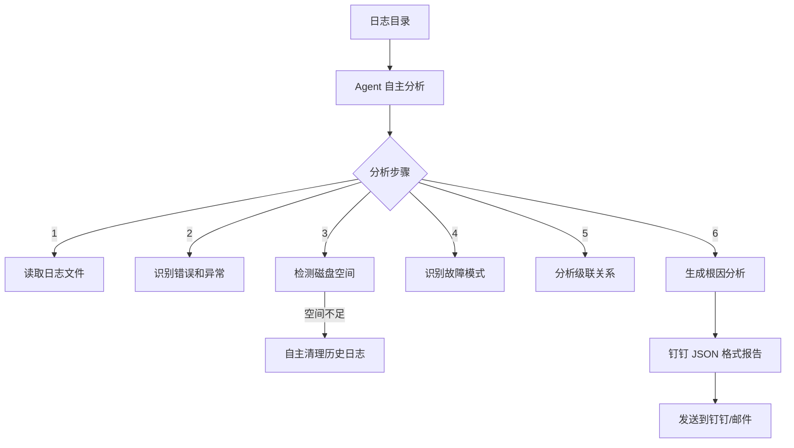

# AI 驱动的日志诊断系统

## 项目概述

基于 LangChain ReAct 框架的智能日志诊断 Agent，自动分析日志文件、识别故障模式、发现级联故障，并生成结构化的诊断报告。

### 核心能力

- 🤖 **AI Agent 诊断**：基于 ReAct (Reason + Act) 框架的多步推理
- 📊 **流量与异常分析**：自主分析物联网设备上报频率，支持 TPS 统计与动态风险评估
- 🧹 **自主空间维护**：当磁盘使用率超过 80% 时，Agent 可自主清理应用历史日志
- 🔗 **级联故障识别**：识别多个服务故障之间的因果关系
- 📊 **模式识别**：自动识别常见的故障模式（数据库连接、内存溢出、网络超时等）
- 📋 **结构化报告**：生成符合钉钉 JSON 格式的诊断报告
- 🔔 **智能告警**：支持告警缓冲、分级通知、多渠道发送

### 工作流程



## 快速开始

### 1. 创建虚拟环境

**Windows 环境**：

```bash
# 在项目根目录创建虚拟环境
python -m venv venv

# 激活虚拟环境
venv\Scripts\activate

# 验证 Python 版本（推荐 3.10 或 3.12）
python --version
```

**Linux 环境**（需要先安装 Python）：

**方式一：使用包管理器安装（推荐）**

```bash
# 以 Ubuntu/Debian 为例
sudo apt-get update
sudo apt-get install python3.12 python3.12-venv python3.12-dev
```

**方式二：手动编译安装（无 Python 预装环境）**

```bash
# 1. 下载 Python 源码（已下载到本地）
# 手动下载 Python-3.12.12.tar.xz 后上传到服务器

# 2. 解压
tar -xf Python-3.12.12.tar.xz
cd Python-3.12.12

# 3. 配置（开启优化）
./configure --enable-optimizations

# 4. 编译（严格限制使用2核）
make -j2

# 5. 安装
sudo make altinstall

# 6. 验证安装
python3.12 --version
```

创建虚拟环境后，安装依赖：

### 2. 安装依赖

激活虚拟环境后，安装项目依赖：

```bash
# 先创建虚拟环境
python3.12 -m venv venv

# 激活虚拟环境
source venv/bin/activate

# 验证 Python 版本
python --version

# 安装依赖
pip install -r requirements.txt
```

或手动安装指定版本：

```bash
# 核心依赖 (指定稳定版本)
pip install langchain==0.2.16 langchain-community==0.2.16 langchain-core==0.2.38 langchain-openai==0.1.23

# 工具依赖
pip install python-dotenv requests pydantic psutil
```

### 3. 配置环境变量

在项目根目录新建 `.env` 文件（所有配置都集中在这里）。

**⚠️ 关键提示**: 确保 `LOG_DIRECTORY` 指向一个**真实存在**的日志目录，且目录中包含 `.log` 文件。

```env
# LLM 配置（推荐使用 DeepSeek）
DEEPSEEK_API_KEY=your-api-key
DEEPSEEK_BASE_URL=https://api.deepseek.com
DEEPSEEK_MODEL_ID=deepseek-chat

# 钉钉机器人配置 (用于接收报告)
DINGTALK_ACCESS_TOKEN=your-token
DINGTALK_SECRET=your-secret
# 值班人员手机号，多个用逗号分隔，用于 P1/P2 级别告警 @
DINGTALK_ON_DUTY_MOBILES=18180861207,13883578974

# 日志诊断配置
LOG_ENVIRONMENT=prod              # dev/test/prod
LOG_DIRECTORY=/home/sutaiyun/logs # 日志文件所在的绝对路径

# Agent 行为配置
AGENT_TEMPERATURE=0.3             # 0.0-1.0，越小分析越严谨
AGENT_MAX_ITERATIONS=15           # ReAct 最大推理步数
AGENT_ENABLE_ALERT_BUFFER=true    # true:启用防骙扰缓冲; false:实时发送
AGENT_ENABLE_NOTIFICATIONS=true   # 全局通知开关
```

### 4. 运行诊断

```bash
python main.py
```

程序启动后会自动执行：
1. **配置自检**：检查 API Key、日志路径权限等。
2. **初始化 Agent**：加载 LangChain ReAct 核心组件。
3. **自主分析**：读取日志 -> 识别故障 -> 归因分析。
4. **发送报告**：生成 Markdown 格式的 JSON 报告并推送到钉钉。

### 5. 手动日志清理（可选）

如果需要立即释放磁盘空间，可以运行手动清理脚本。该脚本会按修改时间从早到晚清理 `APP_LIST` 中配置的应用日志备份（`.log.gz` 或旧的 `.log` 文件）。

```bash
# 交互式清理（需输入 y 确认）
python manual_clean.py

# 静默清理（直接执行，用于脚本调用）
python manual_clean.py --yes

# 指定清理上限（默认 100 个文件）
python manual_clean.py --limit 50
```

### 6. Linux 定时任务（可选）

如果需要每天早上 8 点自动执行诊断，可以配置 cron 任务。日志会输出到 `logs/` 目录下，並按日期自动分割。

#### 方案一：使用 crontab + logrotate（推荐）

**1. 创建日志目录**

```bash
mkdir -p /path/to/log_agent/logs
```

**2. 配置 crontab 任务**

```bash
crontab -e

# 添加下面的一行（每天早上 8 点执行）
0 8 * * * cd /path/to/log_agent && /path/to/venv/bin/python main.py >> logs/cron_$(date +\%Y-\%m-\%d).log 2>&1
```

**配置说明**：
- `logs/cron_$(date +\%Y-\%m-\%d).log`：每天生成一个格式为 `cron_2026-01-08.log` 的文件

**3. 配置 logrotate 自动清理旧日志（可选）**

若要保持一段时间后自动清理，可以配置 logrotate：

```bash
# 作为 root 执行
sudo vi /etc/logrotate.d/log_agent

# 添加以下配置（保持 30 天的日志）
/path/to/log_agent/logs/cron_*.log {
    daily
    rotate 30
    compress
    delaycompress
    missingok
    notifempty
}
```

#### 方案二：使用 Shell 脚本自定义日志输出

**1. 创建脚本文件 `run_diagnosis.sh`**

```bash
#!/bin/bash

# 设置项目路径
PROJECT_DIR="/path/to/log_agent"
LOG_DIR="${PROJECT_DIR}/logs"
VENV_PYTHON="${PROJECT_DIR}/venv/bin/python"

# 创建日志目录
mkdir -p "${LOG_DIR}"

# 符合日期格式的日志文件
LOG_FILE="${LOG_DIR}/cron_$(date +%Y-%m-%d).log"

# 执行主程序並输出日志
cd "${PROJECT_DIR}" && ${VENV_PYTHON} main.py >> "${LOG_FILE}" 2>&1
```

**2. 赋予脚本执行权限**

```bash
chmod +x /path/to/log_agent/run_diagnosis.sh
```

**3. 配置 crontab 任务**

```bash
crontab -e

# 添加下面的一行
0 8 * * * /path/to/log_agent/run_diagnosis.sh
```

#### 常用命令

```bash
# 查看 crontab 任务列表
crontab -l

# 删除 crontab 任务
crontab -r

# 查看最新的日志
tail -f logs/cron_$(date +%Y-%m-%d).log

# 查看所有 cron 日志
ls -lh logs/cron_*.log
```

## 版本信息

```
log_agent/
├── agent/
│   ├── __init__.py
│   └── iot_diagnosis_agent.py      # AI 诊断 Agent 主类
├── tools/
│   ├── log_reader.py               # 基础日志读取工具
│   ├── device_anomaly_analyzer.py  # 设备流量与频率分析工具 (核心：30w 行/秒级反向分析)
│   ├── log_cleaner.py              # 日志清理工具
│   ├── code_interpreter.py         # Python 统计分析工具
│   ├── system_monitor.py           # 系统状态监控工具 (磁盘阈值 80%)
│   ├── stack_trace_cleaner.py      # 堆栈清洗工具
│   ├── alert_buffer.py             # 告警缓冲池
│   └── notification_manager.py     # 通知发送器
├── .env                            # 配置文件
├── main.py                         # 程序入口
├── manual_clean.py                 # 手动清理工具 (直接调用入口)
└── README.md                       # 说明文档
```

## 功能详解

### 级联故障识别
Agent 不仅仅是“报错复读机”，它能理解服务间的依赖关系。
*   **场景**：数据库挂了，导致 A 服务连不上，B 服务超时，C 服务报错。
*   **结果**：Agent 会在报告中指出“核心根因是数据库连接失败”，并将 A/B/C 的错误标记为“衍生故障”，而非发送 4 条独立告警。

### 识别的故障模式
内置识别以下常见 Java/IoT 故障：
*   **物联网设备**：超高频上报（>30次/分）、IP 异常变动、流量突发（TPS 监测）
*   **基础组件**：DB 连接池耗尽、Redis 超时、MQ 积压
*   **资源类**：OOM (OutOfMemory)、StackOverflow、CPU 高负载
*   **网络类**：SocketTimeout、ConnectionRefused
*   **代码类**：NullPointer、IndexOutOfBounds、死锁

## 生产环境资源限制 - 风险提示

当系统 CPU 和内存余量不多时，请注意以下风险：

### 主要风险项

| 风险项 | 说明 | 影响 | 优化建议 |
|--------|------|------|--------|
| **LLM API 调用** | 每次诊断会调用 DeepSeek/OpenAI API，可能 3-5s 延迟 | 网络波动可能导致推理变慢 | 先检查 DNS、网络连接；适度降低迭代次数 |
| **大规模日志扫描** | `device_anomaly_analyzer` 扫描上限 30w 行 | 处理不当会导致 CPU 峰值 | 已实现**反向块读取**与**时间窗口早停**，极大降低 I/O |
| **大日志文件处理** | 100MB+ 的日志文件会占用大量内存 | 可能触发 OOM 或 I/O 阻塞 | 保证日志目录不超过 50GB；定期清理过期日志 |
| **多文件并发读取** | 预设 16 个日志文件，每个最多 100 行 | 总计 ~1.6K 行文本，不会超过 Token 限制 | 不用调整，已优化 |
| **Agent 推理步数** | `max_iterations=15` 会导致多轮调用 LLM | 高 CPU/内存占用 | **强烈建议改为 10** |
| **磁盘空间不足** | 磁盘使用率超过 80% 会触发告警并停止写入 | 系统性崩溃风险 | Agent 会尝试调用 `clean_app_logs` 自主清理 |
| **每天 08:00 启动** | crontab 会在 8 点瞬间启动进程 | 可能产生 CPU/内存尖峰 | 改为错峰执行（如 08:30）或提前（如 06:00） |

### 优化建议

#### ⭐ 优先级 1：修改 Agent 推理参数（强烈推荐）

在 `.env` 中修改：

```env
# 关键：降低 Agent 迭代次数（从 15 改为 10）
AGENT_MAX_ITERATIONS=10

# 保持不变
AGENT_TEMPERATURE=0.3
```

这样可以减少约 30-40% 的推理时间和资源消耗。

#### ⭐ 优先级 2：限制日志读取范围（建议）

修改 `.env`，只读取最关键的日志文件：

```env
# 可选：通过环境变量限制日志文件
# 推荐重点监控的文件：bms-server.log, mqtt-server.log, rocketmq.log
lines_per_file=50    # 改为 50 行（原为 100）
```

#### ⭐ 优先级 3：调整定时任务时间（可选）

修改 crontab，避免在固定时间点产生资源尖峰：

```bash
crontab -e

# 改为 08:30 执行（错开整点时刻）
30 8 * * * cd /path/to/log_agent && /path/to/venv/bin/python main.py >> logs/cron_$(date +\%Y-\%m-\%d).log 2>&1

# 或改为 06:00 执行（提前到非高峰时段）
0 6 * * * cd /path/to/log_agent && /path/to/venv/bin/python main.py >> logs/cron_$(date +\%Y-\%m-\%d).log 2>&1
```

#### ⭐ 优先级 4：定期清理日志存储（必做）

确保日志目录不会无限增长：

```bash
# 查看日志目录大小
du -sh /path/to/logs

# 删除 30 天前的日志（每月执行一次）
find /path/to/logs -name "*.log" -mtime +30 -delete

# 或配置 logrotate 自动清理（见前面的 crontab 配置章节）
```

### 建议的完整配置

对于资源有限的生产环境，推荐配置如下：

```env
# LLM 配置
DEEPSEEK_API_KEY=your-api-key
DEEPSEEK_BASE_URL=https://api.deepseek.com
DEEPSEEK_MODEL_ID=deepseek-chat

# 钉钉配置
DINGTALK_ACCESS_TOKEN=your-token
DINGTALK_SECRET=your-secret
DINGTALK_ON_DUTY_MOBILES=18180861207,13883578974

# 日志配置
LOG_ENVIRONMENT=prod
LOG_DIRECTORY=/path/to/logs

# ⚠️ Agent 性能优化（资源有限必须调整）
AGENT_TEMPERATURE=0.3
AGENT_MAX_ITERATIONS=10        # 从 15 改为 10（关键）
AGENT_ENABLE_ALERT_BUFFER=true
AGENT_ENABLE_NOTIFICATIONS=true
```


## 常见运行问题

### 1. 提示"日志目录不存在"
*   **现象**：程序启动时提示 `Path verification failed`。
*   **解决**：
    1. 检查 `.env` 中的 `LOG_DIRECTORY` 路径是否写错。
    2. 确认该目录下确实有以 `.log` 结尾的文件。
    3. Linux 环境下请检查 `python` 进程是否有该目录的读取权限。

### 2. 提示 `ModuleNotFoundError: No module named 'dotenv'`
*   **解决**：你可能漏装了工具包，请执行：
    ```bash
    pip install python-dotenv
    ```

### 3. 钉钉未收到消息
*   **解决**：
    1. 检查 `.env` 中 `AGENT_ENABLE_NOTIFICATIONS` 是否为 `true`。
    2. 检查钉钉机器人的 `Safe Settings`（安全设置）是否勾选了“加签”，且 Secret 是否填对。
    3. 查看项目下的 `notification_logs/` 目录，确认是否有报错日志。

## 版本信息

- **版本**：2.3.0
- **更新日期**：2026-01-20
- **Python 版本**：3.10 或 3.12
- **LangChain 版本**：0.2.16 (已锁定)
- **运行平台**：Windows / Linux

## 许可证

MIT License
